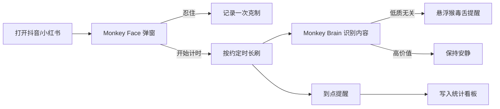
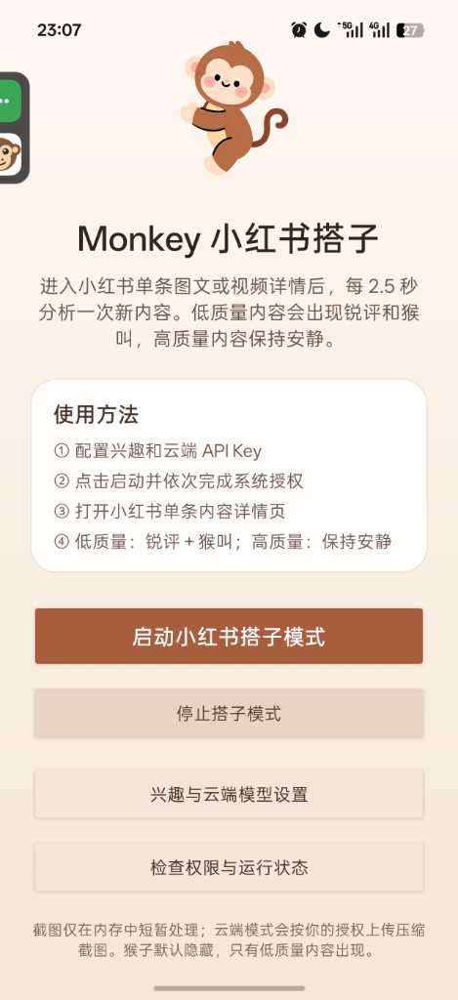
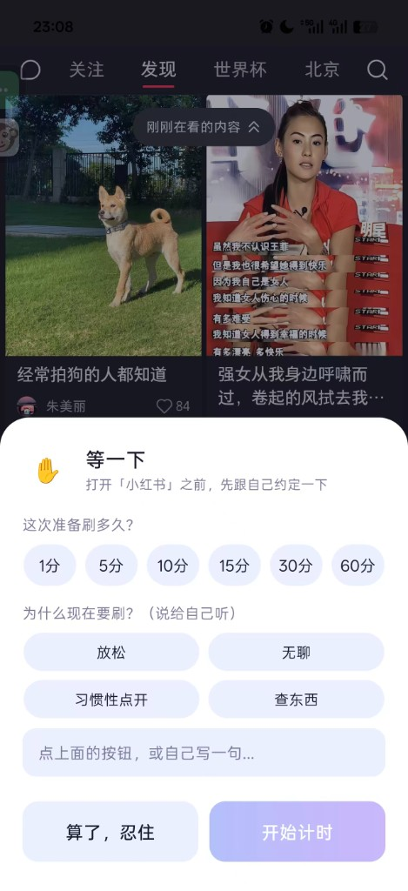
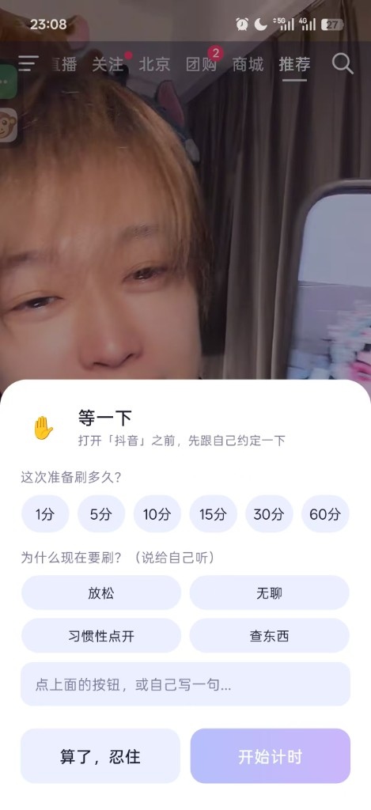

# MONKEYBUDDY

**帮你从无意识刷屏中夺回注意力的选择权。**

一款针对小红书、抖音、B 站、知乎等易上瘾社媒的自律辅助 App。以「猴子搭子」为人格化载体，用**非强制**的方式，在「点开 App 之前」和「刷内容过程中」两次轻轻拍一下你的肩膀。

[](https://github.com/Halyn0712/MONKEYBUDDY)


---

## 目录

- [我们想解决什么](#我们想解决什么)
- [产品怎么工作](#产品怎么工作)
- [两大核心模块](#两大核心模块)
- [产品截图](#产品截图)
- [典型使用流程](#典型使用流程)
- [功能一览](#功能一览)
- [隐私与边界](#隐私与边界)
- [技术架构](#技术架构)
- [本地构建](#本地构建)
- [完整产品介绍 PDF](#完整产品介绍-pdf)

---

## 我们想解决什么

刷短视频、刷信息流的时候，手指往往比脑子快——明明只想看 5 分钟，结果一小时就过去了。卸载 App、设置系统限额都没用，靠意志力对抗算法推荐，太难赢了。

**MONKEYBUDDY** 不做「锁机惩罚」，也不做冷冰冰的「你今天用了 4 小时」事后统计。它要做的是：

| 痛点 | MONKEYBUDDY 的做法 |
|------|-------------------|
| 无意识机械刷屏 | 打开社媒**之前**先约定时长和理由（认知停顿） |
| 低质内容裹挟注意力 | 刷屏**过程中**识别无关/低价值内容并毒舌提醒 |
| 工具太强硬引发逆反 | 温和干预：可「忍住」、可「再刷 5 分钟」，数据自己说话 |
| 刷完空虚却戒不掉 | 今日报告、趋势、历史、理由统计，帮你看清模式 |

> 原生系统只会告诉你「今天用了多久」——我们要追问的是：**这一个小时，你满意吗？**

---

## 产品怎么工作



**一个 APK，两个搭档：**

- **Monkey Face** — 时间管理搭子：约定 → 计时 → 提醒 → 统计
- **Monkey Brain** — 内容筛选搭子：识图 → 判断 → 吐槽 → 引导聚焦

---

## 两大核心模块

### Monkey Face · 刷之前先跟自己约一下

当你打开监控名单里的 App（如小红书、抖音）时，会弹出轻量干预页：

- 选择本次打算刷多久（1 / 5 / 10 / 15 / 30 / 60 分钟）
- 填写或点选「为什么现在要刷」
- **算了，忍住** → 记录克制，不开始计时
- **开始计时** → 进入本次会话，到点温柔提醒

主页提供 **今日报告、本周趋势、历史记录、理由统计**，帮你看见自己的刷屏模式（已移除「手动记一笔」入口，数据全部来自自动监控）。

### Monkey Brain · 你的个性化内容搭子

预设身份与关注领域后，在你刷内容时：

- 每约 **2.5 秒**分析一帧画面（小红书单条详情页等场景）
- **低质无关内容** → 悬浮猴子探出 + 毒舌锐评 + 猴叫
- **高价值匹配内容** → 保持安静，不打扰
- 悬浮猴子图标**保持原版造型**，默认隐藏，仅在需要提醒时出现

支持本地 VLM 与（用户知情同意后的）云端视觉模型；截图仅在内存中短暂处理，不上传、不落盘（云端模式除外）。

---

## 产品截图

### ① Monkey Brain · 小红书搭子设置页

配置兴趣与 API Key，启动搭子模式，完成系统授权后即可在小红书详情页运行。



---

### ② Monkey Face · 打开小红书前的约定弹窗

在惯性点开 App 之前插入「认知停顿」：选时长、写理由，或选择忍住。



---

### ③ Monkey Face · 打开抖音前的约定弹窗

同一套 Face 逻辑适配抖音等监控名单内的应用。



---

### ④ Monkey Brain · 低质内容时的悬浮提醒

检测到无关低质内容时，挂边猴子探出气泡提醒；高价值内容则不打扰。


---

## 典型使用流程

1. **首次设置**
   - 开启「无障碍」与「悬浮窗」权限
   - 在主页 **＋ 管理监控名单** 添加抖音、小红书等 App
2. **配置 Brain**
   - 选择身份 / 关注领域（考研党、考公党、工作党等）
   - 按需配置兴趣标签与云端模型
   - 点击 **授权屏幕识别**，完成系统录屏授权
3. **日常使用**
   - 打开社媒 → Face 弹窗约定时长
   - 开始刷 → Brain 在后台识别内容价值
   - 到点 → Face 温柔提醒；低质内容 → Brain 毒舌打断
4. **复盘**
   - 查看今日报告、趋势、历史与理由分布

---

## 功能一览

| 模块 | 功能 | 说明 |
|------|------|------|
| Face | 前置认知干预 | 打开 App 前选时长 + 理由 |
| Face | 到点提醒 | 支持延后 5 分钟并追加理由 |
| Face | 数据统计 | 今日报告 / 趋势 / 历史 / 理由 |
| Face | 监控名单 | 自定义需管理的社媒 App |
| Brain | 屏幕采集 | 目标 App 前台时周期采样 |
| Brain | 内容识别 | 兴趣相关度 + 信息密度判断 |
| Brain | 毒舌反馈 | 低质吐槽 + 猴叫；高质静默 |
| Brain | 悬浮猴子 | 挂边拖拽，原版造型不变 |
| 全局 | 单 APK | `app` + `monkeybrain` 模块合一 |

---

## 隐私与边界

- **不是内容审查工具**，不评判观点对错，只帮你看清「值不值得继续刷」
- 默认**本地处理**，截图仅在内存中流转，不写文件、不进数据库
- 启用云端 VLM 前需**单独知情同意**；API Key 经系统 Keystore 加密存储
- Face 无障碍服务用于感知「打开了哪个 App」，配合计时与干预，可按需在系统设置中关闭
- 可随时停止搭子模式，或从监控名单移除 App

---

## 技术架构

```
┌─────────────────────────────────────────────────────────┐
│                    MONKEYBUDDY APK                      │
├──────────────────────┬──────────────────────────────────┤
│  app (Monkey Face)   │  monkeybrain (Monkey Brain)       │
│  · WebView 主页/统计  │  · ScreenCaptureService          │
│  · AppWatchService   │  · VlmCoordinator + 本地/云端 VLM  │
│  · OverlayManager    │  · MonkeyOverlayService          │
│  · 会话/闹钟/统计     │  · FeedbackCoordinator           │
└──────────────────────┴──────────────────────────────────┘
          │ MonkeyFaceBridge / MonkeyBrainBridge │
          └────────────── 进程内数据桥接 ──────────┘
```

**工程目录：**

| 路径 | 说明 |
|------|------|
| `app/` | 主应用：Face UI、无障碍监控、干预弹窗 |
| `monkeybrain/` | Brain 库：悬浮猴、采集、VLM、反馈 |
| `MonkeyBody/` | Brain 历史文档与 PRD（参考） |
| `docs/` | 产品介绍 PDF 与截图素材 |

**环境要求：** JDK 17+、Android SDK 35、Android 10+ 真机

---

## 本地构建

```powershell
cd MONKEYBUDDY-main
# 创建 local.properties，例如：
# sdk.dir=D\:\\APP sdk

.\gradlew.bat :app:assembleDebug
```

输出：`app/build/outputs/apk/debug/app-debug.apk`

---

## 完整产品介绍 PDF

更完整的产品叙事、参赛说明与视觉稿见：

📄 **[docs/MONKEYBUDDY.pdf](docs/MONKEYBUDDY.pdf)**（桌面原件：`D:\Desktop\MONKEYBUDDY.pdf`）

---

## 仓库

- **GitHub：** https://github.com/Halyn0712/MONKEYBUDDY
- **包名：** `com.shuagoumei.app`
- **当前版本：** 2.0.0

---

## 一句话总结

> **MONKEYBUDDY = 刷之前想清楚（Face）+ 刷的时候有人怼你（Brain）。**  
> 不锁机、不说教，用一只挂边小猴子，帮你从算法手里抢回一点时间。

---

*TRAE AI 创造力大赛 · 生活娱乐赛道 · MONKEYBUDDY*
